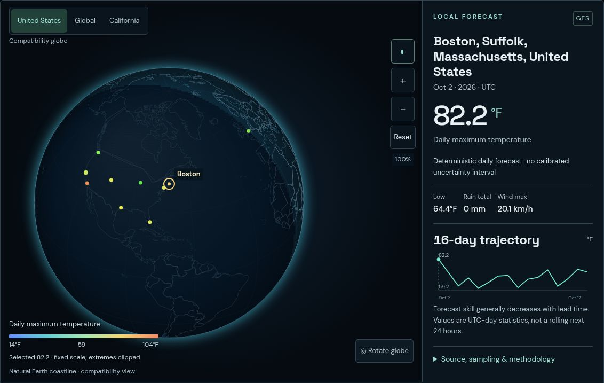
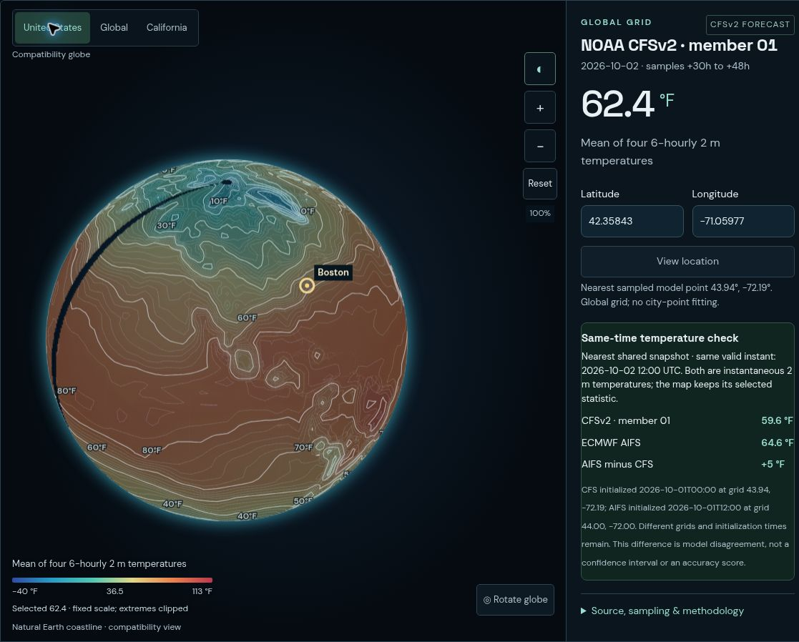
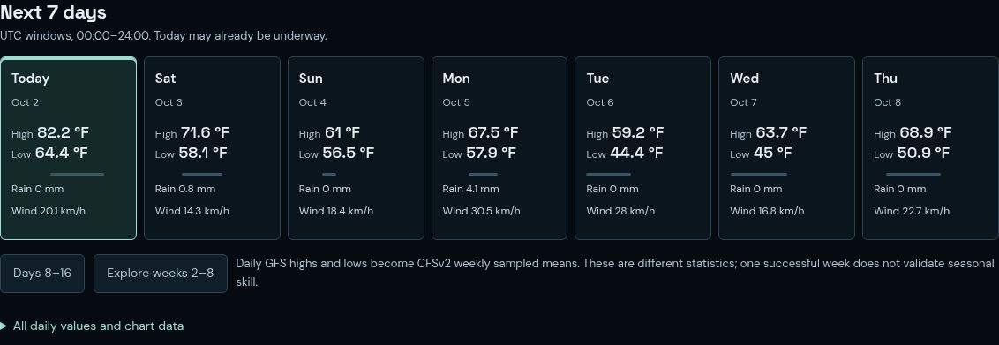

# ENSO Atlas

**[Open the live ENSO Atlas →](https://enso-weather-atlas.bensonlee5.chatgpt.site/)**

A weather exploration dashboard that brings a city forecast, a global globe, and longer-range model guidance into one workspace. Compare temperature and precipitation across time horizons while keeping each product's source, initialization, valid period, and limitations visible.

## Screenshots

Live-app captures from October 2, 2026, before the worldwide ensemble update. Globe images show the Canvas2D compatibility view. Click an image to open it full size.

| City forecast | Global temperature field |
| --- | --- |
| [](docs/screenshots/boston-local-forecast.jpg) | [](docs/screenshots/global-cfs-temperature.jpg) |
| Boston's gold location marker, daily high and low, rain, wind, and forecast trajectory. | CFSv2 member 01 sampled temperature field, labeled contours, and model context. |

<details>
<summary>Seven-day briefing</summary>

[](docs/screenshots/seven-day-briefing.jpg)

A day-by-day GFS briefing with UTC date windows and the longer-range extension kept separate.

</details>

## Explore the atlas

- **Your local outlook:** search a city or five-digit US ZIP code, choose a result, and get a seven-day GFS briefing with a separate days 8–16 extension. Temperature highs/lows, precipitation totals, and maximum wind also appear in a readable table.
- **A shared map and location:** the selected city's gold marker stays on the globe across daily, regional, and global views. Temperature and precipitation are the primary controls; Fahrenheit is the default, with a Celsius toggle.
- **Worldwide maps:** Daily maps open with global CFSv2 temperature fields; Weekly maps show all seven empirical quantiles from a16-member CFSv2 ensemble across both hemispheres and oceans. Regional raw/anomaly products remain explicitly labeled. A named region control moves the camera without replacing the selected weather location.
- **Globe controls:** rotate, zoom, and explore smooth color fields and contours. Independent daylight controls visualize an astronomical instant without changing forecast validity. The WebGL surface has a Canvas2D compatibility fallback.
- **Atmosphere and model lab:** explore GFS pressure-level profiles, the historical calibration pilot, and archived-forecast temperature diagnostics when observations are ready.

The selected location, units, and horizon are remembered in the current browser. **Clear saved city** removes the saved location and its forecast cache and returns to the San Francisco sample. There is no account synchronization or GPS request. City/ZIP searches go to Open-Meteo only on submission; selected coordinates are sent for weather retrieval. ZIP results identify an associated city, not an address or exact postal-area centroid.

## Models and time horizons

| View | Source and coverage | How to read it |
| --- | --- | --- |
| City briefing | NOAA GFS via Open-Meteo, up to 16 days | Daily highs/lows, precipitation totals, and maximum wind; daily windows are UTC |
| Worldwide weekly maps | NOAA CFSv2 16-member lagged ensemble, weeks 1–8 plus separate days 57–60 | Empirical P1/P5/P10/P50/P90/P95/P99 at4,704 native-grid samples (~3.8°); temperature and mean precipitation rate |
| Regional raw outlook | NOAA CFSv2 single member, weeks 1–8 | US-region sampled means, separate from the worldwide ensemble |
| Weekly anomalies | Official NOAA CPC CFSv2 16-member ensemble-mean anomalies, weeks 1–4 | Departures from the product's model climatology; no weeks 5–8 anomaly values or member percentiles |
| Global models | CFSv2 daily sample averages through 60 days; ECMWF AIFS snapshots at lead hours 24, 168, 336, and 360 | Sampled native-grid fields; AIFS dates snap to the nearest available snapshot within its horizon |
| Climate context | NOAA NCEP/NCAR monthly climatology, 1991–2020 | A monthly historical average beyond the selected model horizon, not weather for a future day |
| Historical dates | NOAA NCEP/NCAR Reanalysis 1, supported from 1948-01-01 through 2026-03-17 | Reconstructed weather, not a forecast issued on that date; gaps before current forecasts remain unavailable |

The worldwide ensemble combines members 01–04 from four consecutive 00Z initializations. Older runs are aligned to the same absolute valid times **before** period averaging. P1, P5, P10, P50, P90, P95, and P99 are calculated from the retained member means. The browser loads only map-ready quantiles (under4.5MB uncompressed). The compressed member-means artifact listed in the active storage manifest and its hash retain all member means to six decimals for independent reproduction; the daily pipeline recomputes every quantile before publication. These correlated, uncalibrated samples describe model spread; even P1/P99 do not establish rare-event probabilities or confidence bounds.

### Important interpretation limits

- **Rainfall statistics differ.** CFS precipitation is a mean of sampled instantaneous rates in mm/day-equivalent. AIFS precipitation is accumulated since initialization. Neither is interchangeable with the GFS daily precipitation total. Cross-model rainfall comparison and CFS rainfall verification are withheld.
- **Smooth maps do not add resolution.** Color fields and contours interpolate within genuine grid cells; missing cells, regional boundaries, and polar caps remain empty. Regional readouts use the nearest sampled point only inside that product's footprint. GFS city points are not interpolated into a global weather field.
- **Model disagreement is not accuracy.** The CFS/AIFS temperature comparison uses matching valid instants, but initialization times and sampled coordinates differ. It is not a skill ranking.
- **The Earth image and lighting are context.** NASA's October 2004 Blue Marble composite is historical surface imagery, not live satellite weather. Daylight is astronomical shading; the cloud layer uses GFS hourly city-point values, not a global cloud image.
- **Research is separate from live guidance.** The [calibration pilot](research/pilot/README.md) is a deterministic, no-ENSO experiment for days 15–28 across six broad CONUS regions. Ridge slightly outperformed its small neural model on held-out RMSE. It does not establish local accuracy, weeks 5–8 skill, calibrated probabilities, or a trained ENSO-aware forecast backbone.

This is an exploratory project. Do not use it for safety-critical weather or aviation decisions.

## Run locally

Use **Node.js 22+** for the full app, including historical-date retrieval. There are no runtime npm dependencies or API keys.

```sh
git clone https://github.com/bensonlee5/enso-atlas.git
cd enso-atlas
node scripts/serve.mjs
```

Open **http://localhost:8080**. Set `PORT` to use another port. The server builds the self-contained worker from the checked-in HTML, CSS, JavaScript, and bundled data.

For a static-only preview, Python 3 is enough:

```sh
python -m http.server 8080 --directory dist
```

Open the app over HTTP rather than a file URL. Static hosting supports the dashboard and bundled snapshots, but arbitrary historical-date requests require the `/api/history` server route. `node scripts/build-worker.mjs --forecast-storage` creates `dist/server/index.js` for a Cloudflare-compatible Worker deployment, with live forecast reads supplied by the approved object-storage feed. To run data-dependent tests locally, first restore the hash-verified feed with `python ingestion/publish_forecasts.py restore --data dist/data --state /tmp/enso-feed-state.json`. Generated forecast products are ignored by Git. Building or editing this repository does not itself publish the live site.

## Data freshness and refreshes

- **City forecasts:** fetched on open, cached locally for up to one hour, and refreshed hourly while the page is visible in the daily view. The refresh button requests new GFS data. Retrieval time is not model initialization; the GFS API response does not expose its cycle time.
- **Public model bundle:** the [GitHub Actions workflow](.github/workflows/refresh-weather.yml) is scheduled daily at **09:17 UTC**, also runs on ingestion/workflow changes, and supports manual dispatch. It validates products and the compressed member-means artifact, archives sampled-location outlooks, checks mature temperature periods, and commits only allowlisted data files.
- **Browser updates:** the app checks the object-storage bundle on open and hourly while visible, using a one-hour cache plus schema and SHA-256 validation. Immutable content-addressed files and an atomic latest manifest prevent partial-bundle publication. Failed downloads or validation retain previous data with a warning. Older caches cannot replace a newer loaded run. The app flags CFS ensemble/anomaly runs older than40hours and faster model runs older than24hours while retaining their exact dates and last-good values. GitHub scheduling and upstream availability can delay updates; always inspect the displayed source dates.
- **Bundled fallbacks:** the city forecast and atmosphere snapshots are dated fallbacks, separate from the scheduled seven-product storage bundle. An available page is not proof of a fresh model run.

To reproduce the full ingestion pipeline, use Python 3.12 in an isolated environment and install the dependencies from [ingestion/requirements.txt](ingestion/requirements.txt):

```sh
python -m venv .venv
. .venv/bin/activate
python -m pip install -r ingestion/requirements.txt
python ingestion/refresh_bundle.py
python ingestion/verify_forecasts.py --archive-dir dist/data/archive --output dist/data/verification.json
python ingestion/refresh_bundle.py --manifest-only
node tests/public-data-test.cjs
```

These commands download and validate real upstream products and update local data; they do not publish. The authenticated publisher uploads only verified bytes and atomically promotes a complete bundle. See the storage pipeline instructions for daily/fast modes and bootstrap. The narrower `ingestion/refresh.py` refreshes the raw regional, weekly-anomaly, and observed-ENSO products; it is not the complete bundle entrypoint.

### Archive and verification

Object storage preserves CFS ensemble outlooks for ten sampled locations, not every global field or every searched city. Collection began September 30, 2026; some initial forecasts were captured after their valid periods began. Existing issuance files are not rewritten, and the active index keeps400 issuances. Previous stored objects and release manifests are retained; this version performs no destructive cleanup and does not claim a total-storage cap. Typical new data is approximately21MB/day (about0.6GB/month) if all four faster cycles change; actual usage and platform billing may differ.

Temperature diagnostics wait for completed periods and an observation-latency allowance. They compare forecast P50 with NOAA CPC's `(Tmax + Tmin) / 2` at the nearest observation land-grid point. This is a **proxy diagnostic**: daily windows, sampling, and grids differ. Pending periods have no scores. Daily GFS accuracy is not evaluated by this archive, and the retrospective training pilot is a separate experiment.

## Checks

Run these from the repository root. Python ensemble tests require NumPy from the ingestion requirements; the core research suite skips optional PyTorch checks when PyTorch is absent.

```sh
node --check dist/app.js
for test in app atmosphere-race briefing contours explorer-quality global-grid global-weather globe-renderer public-data public-data-cache smooth-field solar; do
  node "tests/$test-test.cjs" || exit 1
done
node tests/worker-test.mjs
python tests/archive-test.py
python -m unittest discover -s tests -p 'test_*.py' -v
PYTHONPATH=research python -m unittest discover -s research/tests -v
```

The DOM interaction tests require **jsdom as a test-only dependency**. Install it separately and set `JSDOM_MODULE` to its installed module path if it is not on Node's normal module search path:

```sh
node tests/integrated-workspace-test.cjs
node tests/location-search-test.cjs
node tests/location-edge-test.cjs
node tests/global-workspace-regression.cjs
node tests/forecast-storage-test.mjs
```

These tests do not replace visual browser testing. The optional `python tests/gpu-egl-validation.py` requires EGL/Mesa and Pillow and validates the production shaders offscreen; it is not a browser/device frame-rate benchmark.

## Repository guide

- [dist/](dist/): browser app, bundled datasets, and provenance metadata
- [server/](server/) and [scripts/](scripts/): bounded historical-data endpoint, local server, and worker builder
- [ingestion/](ingestion/): reproducible retrieval, validation, archive, and verification code
- [Ensemble methodology](ingestion/ensemble/README.md) and [global products](ingestion/global/README.md): source formats, sampling, and scientific caveats; dated examples describe their recorded runs
- [research/](research/README.md), [model card](research/MODEL_CARD.md), and [completed pilot](research/pilot/README.md): experimental calibration and evaluation
- [tests/](tests/): product validation, interaction, rendering, and verification checks

## Sources and terms

Forecast values retain source URLs, valid periods, and processing details in their JSON assets and the app's source panels.

- **NOAA / Open-Meteo:** [GFS API](https://open-meteo.com/en/docs/gfs-api), [CPC weekly CFSv2 products](https://www.cpc.ncep.noaa.gov/products/CFSv2/weekly/), [observed ENSO indices](https://www.cpc.ncep.noaa.gov/data/indices/wksst9120.for), and [NOAA PSL datasets](https://psl.noaa.gov/data/gridded/)
- **Open-Meteo / GeoNames:** city geocoding and weather data require attribution. The free Open-Meteo service is for noncommercial use and has request limits; review its [terms and privacy](https://open-meteo.com/en/terms) and [pricing](https://open-meteo.com/en/pricing) before commercial or high-traffic deployment
- **ECMWF AIFS:** [ECMWF Open Data](https://www.ecmwf.int/en/forecasts/datasets/open-data), with CC BY 4.0 attribution
- **Map context:** [Natural Earth boundaries via geo-countries](https://github.com/datasets/geo-countries) and [NASA Blue Marble Next Generation](https://science.nasa.gov/earth/earth-observatory/blue-marble-next-generation/base-map/); displayed boundaries do not imply endorsement of territorial claims
- **Pilot dataset:** Microsoft's [SubseasonalClimateUSA](https://github.com/microsoft/subseasonal_data), CC BY 4.0, with derived-data processing documented in the pilot

## Forecast writer security

The public Site serves forecast data read-only. Uploads require a short-lived, signed GitHub Actions OIDC token scoped to this exact repository ID, owner ID, main branch, workflow path, event allowlist and Site audience. Forks, pull-request events, unexpected caller contexts and expired/forged tokens are rejected. No long-lived storage API key is stored in GitHub.

The dependency-installing NOAA prepare job has no upload identity; the separate standard-library publisher obtains it only after validating this run’s transferred bytes. The Worker checks bounded filenames, payload hashes, complete product schemas, archive references, run chronology and per-source initialization monotonicity. Promotion is conditional on the exact previous manifest ETag. Failed or conflicting uploads leave the last good bundle visible.

Activation of the storage binding and workflow trust requires explicit approval. The backend is initially disabled and can be introduced alongside the existing frontend; the frontend switches only after the first real stored bundle is verified. Existing historical GitHub data is not rewritten.
